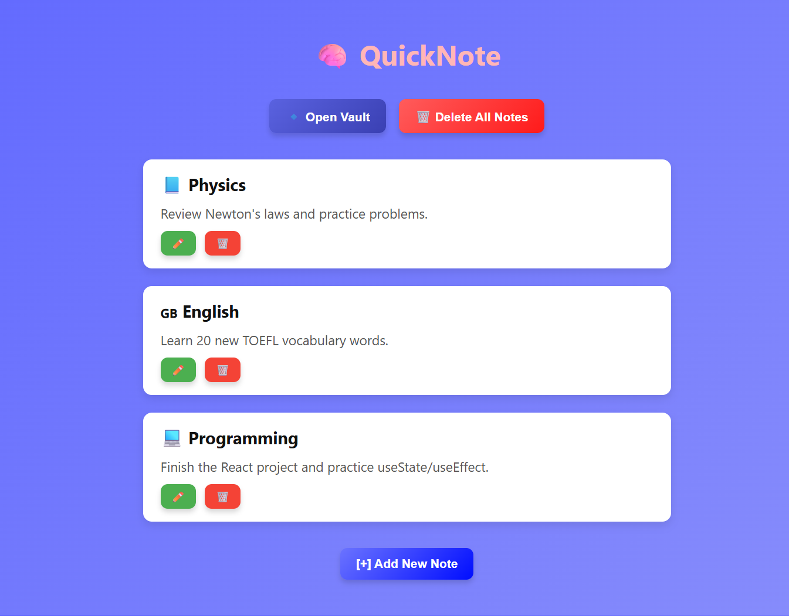

# Quick Note 📝

A modern React application for creating, editing, and organizing notes with persistent storage and animated UI.

## Features
- Add, edit, and delete notes
- Smooth animations when adding/removing notes
- Notes saved in LocalStorage (persist between refresh)
- Responsive design for desktop and mobile

## Technologies
- React (Hooks: useState, useEffect)
- CSS3 + Flexbox
- LocalStorage for persistence
- React Transition Group for animations

## Screenshot / Demo

*(Optional: GIF showing add/delete animations)*

## Getting Started
1. Clone the repository:
```bash
git clone https://github.com/gevorgbazoian/quick-note.git
## Getting Started

1. Clone the repository:
```bash
git clone https://github.com/gevorgbazoian/quick-note.git

Install dependencies:
npm install

Start the development server:
npm start
